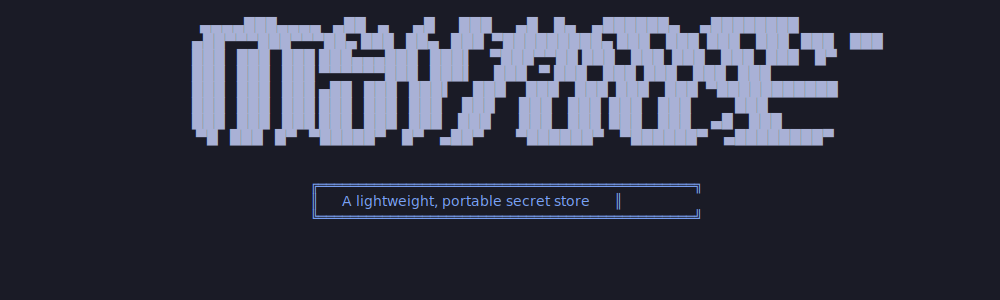

# Mythos
Mythos is a lightweight system that protects small collections of text based secrets with strong cryptography.

Mythos is designed to be as simple and portable as possible. It does not require external authentication servers or database systems to store or retrieve secrets. But in exchange for this simplicity and portability, Mythos does not support multiple users or fine grained roles/entitlement. 

Mythos is not an enterprise secrets manager. It is designed to support personal protection use cases (e.g.: protecting a list of passwords or private keys backed up in public cloud storage) with encryption typically used in defense or military environments.

## How It Works
Mythos protects collections of secrets entrusted to it in a **Legend**, an encrypted file. 

Legends are protected at rest with [AES-256 GCM](https://en.wikipedia.org/wiki/Galois/Counter_Mode) encryption. The key for this encryption (i.e.: its **Data Encryption Key** or **DEK**) is never stored. Instead it is generated once when a Legend is first *initialized* and reconstructed every time a permitted user wants to access that Legend. 

When a Legend is first initialized, Mythos helps the user create a DEK using [Shamir's Secret Sharing Algorithm](https://en.wikipedia.org/wiki/Shamir%27s_secret_sharing). Mythos does this by generating **Shard Keys**, a set of Shamir's keys that reconstruct a Legend's DEK. When a user wants to use Mythos to access a Legend, they load these Shard Keys into Mythos' **Keyring**. If enough matching keys are entered into the keyring, the Legend is unlocked and its secrets are accessable. 

# Cryptographic Security
Mythos protects its secrets with cryptography and cryptographic security parameters (CSPs) derived from the [BouncyCastle](https://www.bouncycastle.org/) libraries. 

